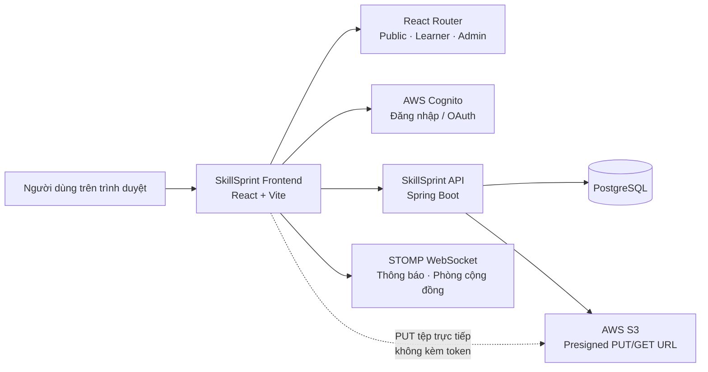

<div align="center">
  <a href="https://skillsprint.site">
    
  </a>

  # SkillSprint

  **Nền tảng học tập có trợ lý AI, giúp người học biến mục tiêu thành lộ trình, thói quen và kết quả đo được.**

  [Khám phá tính năng](#tính-năng-nổi-bật) · [Bắt đầu phát triển](#bắt-đầu-nhanh) · [Kiến trúc](#kiến-trúc-tổng-quan) · [Đóng góp](#đóng-góp)
</div>

---

## Mục lục

- [Giới thiệu](#giới-thiệu)
- [Repositories liên quan](#repositories-liên-quan)
- [Tính năng nổi bật](#tính-năng-nổi-bật)
- [Công nghệ sử dụng](#công-nghệ-sử-dụng)
- [Kiến trúc tổng quan](#kiến-trúc-tổng-quan)
- [Bắt đầu nhanh](#bắt-đầu-nhanh)
- [Biến môi trường](#biến-môi-trường)
- [Lệnh thường dùng](#lệnh-thường-dùng)
- [Cấu trúc mã nguồn](#cấu-trúc-mã-nguồn)
- [Luồng kỹ thuật quan trọng](#luồng-kỹ-thuật-quan-trọng)
- [Định tuyến chính](#định-tuyến-chính)
- [Kiểm thử và chất lượng](#kiểm-thử-và-chất-lượng)
- [Triển khai](#triển-khai)
- [Đóng góp](#đóng-góp)
- [Khắc phục sự cố](#khắc-phục-sự-cố)

## Giới thiệu

**SkillSprint** là ứng dụng web EdTech dành cho người học, người sáng tạo nội dung và quản trị viên. Nền tảng hỗ trợ tổ chức việc học theo workspace, phân tích tài liệu bằng AI để tạo cấu trúc kiến thức và roadmap, theo dõi tiến độ, luyện tập với quiz, học tập tập trung và kết nối cộng đồng.

Repository này chứa **frontend** của SkillSprint: một single-page application (SPA) viết bằng React và TypeScript. Backend là dịch vụ Spring Boot tách riêng; dữ liệu được lưu trên PostgreSQL, xác thực dựa trên AWS Cognito và tệp được tải trực tiếp lên AWS S3 bằng presigned URL.

## Repositories liên quan

| Repository | Vai trò | Liên kết |
| --- | --- | --- |
| SkillSprint Frontend | Giao diện web SPA cho người học, creator và quản trị viên. | [AnhKhoaa157/SkillSprint-FE](https://github.com/AnhKhoaa157/SkillSprint-FE) |
| SkillSprint Backend | API, nghiệp vụ, xác thực, tích hợp cơ sở dữ liệu và dịch vụ lưu trữ. | [HieuPT-04/Project_SkillSprint](https://github.com/HieuPT-04/Project_SkillSprint) |

Khi phát triển tính năng có gọi API, hãy đối chiếu request/response DTO ở repository backend để bảo đảm tên trường, enum và contract dữ liệu giữa hai ứng dụng luôn đồng bộ.

### Các nhóm người dùng

| Nhóm | Giá trị chính |
| --- | --- |
| Người học | Quản lý mục tiêu, tạo lộ trình học, theo dõi tiến độ, học với AI và làm quiz. |
| Creator | Tạo, xác thực và phát hành bộ quiz/learning pack trên marketplace. |
| Quản trị viên | Quản lý người dùng, marketplace, nội dung cộng đồng, phản hồi, thông báo và tình trạng hệ thống. |

## Tính năng nổi bật

### Không gian học tập và AI

- Tạo và quản lý **workspaces** theo từng mục tiêu học tập.
- Tải tài liệu học tập, theo dõi trạng thái xử lý và để AI phân tích nội dung.
- Sinh và chỉnh sửa **learning structure**; xác nhận cấu trúc trước khi tạo roadmap.
- Sinh roadmap học tập, cập nhật trạng thái từng bước và theo dõi tiến độ.
- Trợ lý AI theo ngữ cảnh workspace/roadmap.

### Lập kế hoạch, học và đánh giá

- Lịch học, tác vụ và bảng Eisenhower để ưu tiên công việc.
- Pomodoro, phiên học và trình phát nội dung học tập.
- Quiz do AI tạo theo phiên học, chấm điểm và hiển thị kết quả.
- Điểm thưởng, leaderboard và các chỉ số tiến độ.

### Cộng đồng và marketplace

- Bảng tin cộng đồng: đăng bài, bình luận, tương tác và báo cáo nội dung.
- Phòng cộng đồng thời gian thực qua WebSocket/STOMP: thành viên, vai trò, lời mời, ghim nội dung và kiểm duyệt tin nhắn.
- Marketplace cho quiz pack: khám phá, học bộ nội dung đã sở hữu, ví và luồng creator.
- Gói dịch vụ, thanh toán SePay và lịch sử giao dịch.

### Quản trị và vận hành

- Dashboard quản trị, hồ sơ admin và quản lý người dùng/điểm.
- Quản lý gói đăng ký, marketplace, phản hồi và kiểm duyệt cộng đồng.
- Thông báo toàn hệ thống, theo dõi sức khỏe dịch vụ và chế độ bảo trì.
- Bảo vệ route theo phiên đăng nhập và vai trò `ADMIN`/`LEARNER`.

## Công nghệ sử dụng

| Nhóm | Công nghệ |
| --- | --- |
| UI | React 18, TypeScript (strict), React Router 7 |
| Build & styling | Vite 6, Tailwind CSS 4, PostCSS |
| Thành phần giao diện | Radix UI, MUI, Lucide, class-variance-authority |
| Form & validation | React Hook Form, Zod |
| Chuyển động & biểu đồ | Motion, Recharts, canvas-confetti |
| Dữ liệu & giao tiếp | Fetch API, Axios, STOMP/WebSocket |
| Xác thực & hạ tầng | AWS Cognito, Spring Boot API, AWS S3 presigned URL |
| Kiểm thử | Vitest, React Testing Library, jsdom |
| Triển khai | Vercel |

## Kiến trúc tổng quan



Ứng dụng được tổ chức theo các lớp rõ ràng:

- **Pages và components** hiển thị giao diện, điều phối tương tác người dùng.
- **`src/api/**`** chứa service có kiểu dữ liệu, đóng vai trò là ranh giới duy nhất cho các lời gọi mạng.
- **Contexts và hooks** giữ trạng thái xuyên suốt như phiên đăng nhập, Pomodoro, socket thông báo và dữ liệu workspace.
- **Layouts và route guards** bảo vệ khu vực người học và quản trị viên.

## Bắt đầu nhanh

### Yêu cầu

- Node.js bản LTS đang được hỗ trợ.
- npm (dự án có `package-lock.json`; nên dùng npm để giữ dependency tree nhất quán).
- Backend SkillSprint đang chạy cục bộ hoặc URL API phù hợp.

### Cài đặt

```bash
git clone https://github.com/AnhKhoaa157/SkillSprint-FE.git
cd SkillSprint-FE
npm ci
```

Nếu bạn chủ động thêm hoặc cập nhật dependency, dùng `npm install` thay cho `npm ci`.

### Thiết lập môi trường và chạy ứng dụng

1. Tạo `.env` từ mẫu `.env.example`.

   macOS/Linux:

   ```bash
   cp .env.example .env
   ```

   PowerShell:

   ```powershell
   Copy-Item .env.example .env
   ```

2. Cập nhật các giá trị cần thiết trong `.env`.

3. Khởi động môi trường phát triển:

   ```bash
   npm run dev
   ```

Vite sẽ in URL local vào terminal (thông thường là `http://localhost:5173`). Khi chạy ở local, frontend mặc định gọi backend tại `http://localhost:8080` nếu `VITE_API_URL` chưa được đặt.

## Biến môi trường

Tham khảo [`.env.example`](.env.example) trước khi cấu hình. Không commit `.env` hoặc bất kỳ khóa bí mật nào vào repository.

| Biến | Bắt buộc | Mục đích | Ví dụ local |
| --- | --- | --- | --- |
| `VITE_API_URL` | Có | Base URL của SkillSprint API | `http://localhost:8080` |
| `VITE_COGNITO_DOMAIN` | Khi dùng Cognito tùy chỉnh | Hosted UI domain của AWS Cognito | `https://<domain>.auth.ap-southeast-1.amazoncognito.com` |
| `VITE_COGNITO_CLIENT_ID` | Khi dùng Cognito tùy chỉnh | Client ID của Cognito App Client | `<cognito-client-id>` |
| `VITE_COGNITO_REDIRECT_URI` | Tham khảo | URI callback trong mẫu cấu hình. Ứng dụng hiện lấy callback từ origin trình duyệt. | `http://localhost:5173/auth/callback` |

> Trong production, cấu hình hiện tại chỉ chấp nhận API `https://api.skillsprint.site`. Hãy đăng ký chính xác callback URL trên Cognito cho mỗi domain được triển khai.

## Lệnh thường dùng

| Lệnh | Mục đích |
| --- | --- |
| `npm run dev` | Chạy Vite development server. |
| `npm run build` | Tạo production bundle vào `dist/`. |
| `npm run type-check` | Kiểm tra TypeScript mà không sinh file. |
| `npm test` | Mở Vitest ở watch mode. |
| `npm run test:ci` | Chạy toàn bộ test một lần, phù hợp cho CI. |

Trước khi mở pull request, chạy tối thiểu:

```bash
npm run type-check
npm run test:ci
npm run build
```

## Cấu trúc mã nguồn

```text
SkillSprint-FE/
├── public/                       # Logo, hình ảnh, video và static assets
├── src/
│   ├── api/                      # Typed API services theo domain nghiệp vụ
│   │   ├── admin/                # Người dùng, gói dịch vụ, dashboard, kiểm duyệt
│   │   ├── auth/                 # Đăng nhập, Cognito OAuth, session expiry
│   │   ├── billing/              # Subscription và thanh toán SePay
│   │   ├── community/            # Feed, phòng cộng đồng, kiểu dữ liệu
│   │   ├── core/                 # Cấu hình API và HTTP clients dùng chung
│   │   ├── learning/             # Tài liệu, roadmap, quiz, tiến độ, phiên học
│   │   ├── marketplace/          # Catalog, quiz pack, ví và creator flow
│   │   ├── system/               # Maintenance, health, announcement
│   │   └── utilities/            # Workspace, calendar, tutor, feedback, profile
│   ├── app/
│   │   ├── components/           # UI tái sử dụng, guards, modals, landing
│   │   ├── contexts/             # Auth và Pomodoro context
│   │   ├── hooks/                # Hooks dữ liệu và STOMP WebSocket
│   │   ├── layouts/              # Root, dashboard và admin layouts
│   │   ├── pages/                # Public, auth, learner, community, marketplace, admin
│   │   ├── App.tsx               # Providers, router và toast notifications
│   │   └── routes.ts             # Route registry và route protection
│   ├── components/               # Thành phần dùng ngoài app shell (maintenance, admin)
│   ├── hooks/                    # Shared hooks
│   ├── styles/                   # Global CSS, Tailwind, theme và font
│   └── test/                     # Thiết lập Vitest/Testing Library
├── .env.example                  # Mẫu biến môi trường
├── vercel.json                   # Cấu hình SPA fallback cho Vercel
├── vite.config.ts                # Cấu hình Vite, React và Tailwind
└── vitest.config.ts              # Cấu hình unit/component tests
```

## Luồng kỹ thuật quan trọng

### Xác thực và phân quyền

1. Người dùng đăng nhập bằng email/mật khẩu hoặc Cognito Hosted UI.
2. Frontend lưu phiên, gồm access token và session ID.
3. Request được xác thực mang `Authorization: Bearer <token>` và `X-Session-Id`.
4. Khi nhận `401`, ứng dụng thử làm mới phiên một lần; nếu không thành công, người dùng được chuyển về luồng hết hạn phiên.
5. `RequireAuth` và `RequireAdminAuth` bảo vệ các route tương ứng. Trong maintenance mode, admin vẫn có thể vận hành hệ thống.

### Tải tệp lên S3

Không gửi file qua API server. Đây là quy trình chuẩn cho tài liệu và ảnh phản hồi:

```text
Frontend ── xin presigned URL ──► Backend
Frontend ── PUT raw file (đúng Content-Type, không Authorization) ──► AWS S3
Frontend ── gửi objectKey để xác nhận/lưu metadata ──► Backend
```

- Chỉ lưu **`objectKey`** trong dữ liệu nghiệp vụ; URL xem tệp là presigned URL có thời hạn.
- Phải kiểm tra loại tệp, dung lượng và phản hồi lỗi của lần `PUT` trước khi xác nhận với backend.
- Không thay `objectKey` bằng URL đầy đủ; backend có thể bỏ qua trường không đúng DTO mà không báo lỗi.

### API và trạng thái bất đồng bộ

- Mọi truy cập mạng thuộc `src/api/**`; components không gọi `fetch` tùy tiện.
- Dự án duy trì các API client hiện có theo từng domain (fetch-based và Axios-based). Khi phát triển, hãy dùng đúng client mà service lân cận đang dùng.
- Payload gửi lên backend phải được dựng tường minh theo DTO, vì các trường không khớp có thể bị backend bỏ qua.
- Các thao tác upload, thanh toán, tạo nội dung và quản trị phải có trạng thái loading, success/error rõ ràng.

### Thời gian thực

Hooks `useNotificationSocket` và `useCommunityChatSocket` dùng STOMP WebSocket cho thông báo và chat phòng cộng đồng. Luôn dọn dẹp kết nối khi component unmount để tránh nhiều subscription trùng lặp.

## Định tuyến chính

| Khu vực | Route mẫu | Nội dung |
| --- | --- | --- |
| Công khai | `/`, `/features`, `/pricing`, `/about`, `/contact` | Landing, giới thiệu, bảng giá và liên hệ. |
| Xác thực | `/login`, `/auth/callback`, `/admin-login` | Đăng nhập, callback Cognito và đăng nhập quản trị. |
| Người học | `/app/workspaces`, `/app/workspaces/:id`, `/app/calendar` | Workspace, tài liệu, roadmap, tiến độ và kế hoạch học. |
| Học tập | `/app/learning/course`, `/app/learning/quiz/:quizId` | Course player và quiz. |
| Cộng đồng | `/app/community`, `/app/community/rooms/:roomId` | Feed, phòng và chat cộng đồng. |
| Marketplace | `/app/marketplace`, `/app/my-packs`, `/app/wallet` | Catalog, nội dung đã sở hữu và ví. |
| Creator | `/app/creator/marketplace` | Quản lý, tạo và xác thực quiz pack. |
| Quản trị | `/admin`, `/admin/users`, `/admin/health`, `/admin/marketplace` | Dashboard và các công cụ vận hành. |

Danh sách route đầy đủ nằm tại [`src/app/routes.ts`](src/app/routes.ts).

## Kiểm thử và chất lượng

Test được đặt cạnh mã nguồn theo tên `*.test.ts` hoặc `*.test.tsx`. Vitest chạy trong môi trường `jsdom` và đã tích hợp React Testing Library.

- Ưu tiên bổ sung test tập trung khi thay đổi API mapping, xác thực/phiên, maintenance, thanh toán, cộng đồng hoặc shared hooks.
- Dùng TypeScript strict; không thêm `any` hay chỉ thị bỏ qua lỗi TypeScript để che lỗi.
- Dùng import tương đối trong `src/`; alias `@/` không được TypeScript resolver của dự án hỗ trợ.
- Giữ copy giao diện, định dạng số/ngày và trải nghiệm người dùng theo tiếng Việt (`vi-VN`).

## Triển khai

Ứng dụng được cấu hình cho **Vercel** qua [`vercel.json`](vercel.json):

- `npm install` cài dependency.
- `npm run build` sinh static bundle tại `dist/`.
- Mọi route được fallback về `index.html`, để React Router xử lý điều hướng phía client.

Trước khi deploy, thiết lập `VITE_API_URL` và cấu hình Cognito phù hợp trong environment variables của môi trường triển khai. Không đưa thông tin nhạy cảm vào frontend: mọi biến `VITE_*` đều được đóng gói vào client bundle.

## Đóng góp

1. Fork hoặc tạo branch từ `main` đã cập nhật.
2. Tạo branch mô tả ngắn gọn, ví dụ `feat/workspace-progress`.
3. Thực hiện thay đổi nhỏ, tập trung và không làm ảnh hưởng mã không liên quan.
4. Chạy các kiểm tra chất lượng:

   ```bash
   npm run type-check
   npm run test:ci
   npm run build
   ```

5. Mở pull request, mô tả rõ vấn đề, giải pháp, ảnh/video giao diện (nếu có) và các bước kiểm thử.

Khi thay đổi API, hãy kiểm tra đúng DTO của backend. Khi thay đổi upload, giữ nguyên contract S3 presigned URL. Khi thay đổi giao diện, tái sử dụng các primitives sẵn có tại `src/app/components/ui/` nếu phù hợp.

## Khắc phục sự cố

| Vấn đề | Cách kiểm tra / xử lý |
| --- | --- |
| Không gọi được API local | Kiểm tra backend chạy tại `http://localhost:8080`, `VITE_API_URL` và cấu hình CORS. |
| Đăng nhập Cognito không quay về app | Kiểm tra Cognito callback URL khớp chính xác origin hiện tại + `/auth/callback`. |
| Upload S3 thất bại | Kiểm tra `Content-Type` của `PUT` trùng loại đã ký, không gửi auth header và xác nhận CORS bucket. |
| Màn hình báo bảo trì | Kiểm tra endpoint trạng thái hệ thống; tài khoản admin được miễn giới hạn để vận hành. |
| Route Vercel trả 404 khi refresh | Kiểm tra deployment dùng [`vercel.json`](vercel.json) và output directory là `dist`. |
| Type-check không tìm thấy module | Kiểm tra import tương đối; TypeScript hiện không cấu hình `@/` path alias. |

---

<div align="center">
  Được xây dựng cho hành trình học tập có mục tiêu, có phản hồi và có động lực. 🚀
</div>
